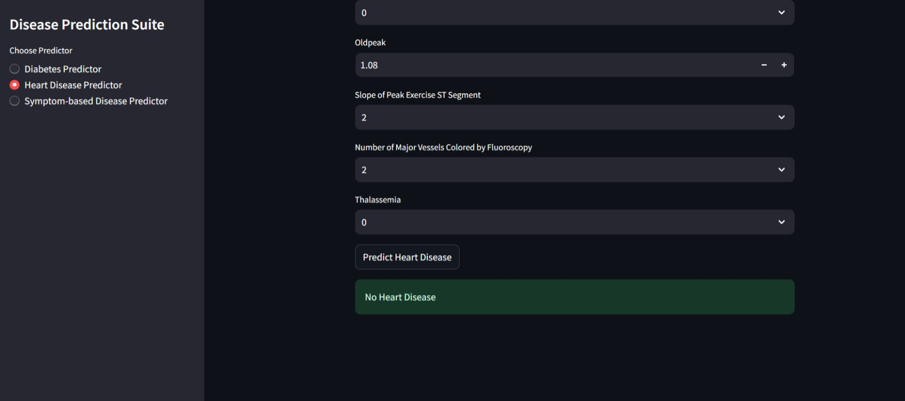

# 🧠 Health AI — Multi-Disease Prediction App

Welcome to **Health AI**, a machine learning-based healthcare assistant that predicts:
- ✅ Diabetes (Random Forest)
- ❤️ Heart Disease (Decision Tree)
- 🩺 General Diseases from Symptoms (Multi-class Classifier)

This project integrates all three into a single, user-friendly **Streamlit** web interface, designed for accessibility and ease of use.

---
## 🔍 UI Preview

Here is a preview of the UI:

.jpeg)
.jpeg)
.jpeg)



## 🚀 Features

- **Diabetes Prediction:** Based on clinical input data (Glucose, BMI, Age, etc.)
- **Heart Disease Prediction:** Uses key heart-related health indicators (Cholesterol, ECG, etc.)
- **Disease from Symptoms:** Predicts likely illness based on selected symptoms (404-feature one-hot encoded symptom list)

---

## 🖼️ UI Preview

> Streamlit app interface with sidebar navigation:
- 🩸 Predict Diabetes
- ❤️ Predict Heart Disease
- 🤒 Predict Disease from Symptoms

---

## 📁 Folder Structure

```bash
Health AI/
├── diabetes/                # Trained diabetes model (.pkl)
├── heart disease/          # Trained heart model (.pkl)
├── Symptom-Disease/        # Symptom-based disease model (.pkl)
├── streamlit-ui/
│   └── ui.py               # Streamlit app entry point
             # Jupyter Notebooks for model training
