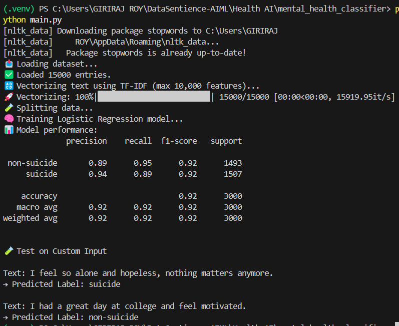

A machine learning-based system that detects signs of moderate to severe depression based on user-generated text inputs—such as journal entries, social media posts, or questionnaire responses. The model uses Natural Language Processing (NLP) to identify suicidal or non-suicidal content with the help of logistic regression and TF-IDF features.

📌 Project Goals
Predict if a user is at risk of moderate or severe depression

Use journal-style text inputs or PHQ‑9-like questions

Build a foundation for a mental health screening tool

🧠 Model Details
Feature	Description
Model Type	Logistic Regression
Feature Extraction	TF-IDF (Top 10,000 features)
Dataset Size	15,000 cleaned Reddit posts
Labels	suicide, non-suicide
Evaluation	Precision, Recall, F1-Score