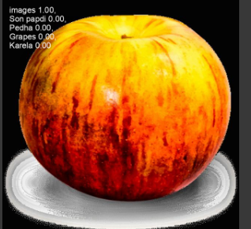

# 🍝 Food Classifier AI

A deep learning-based image classifier designed to identify different food items from images using **YOLOv8n-cls**. This project utilizes a custom dataset of Indian and global food categories, trained and tested in Google Colab using the Ultralytics YOLO framework.

---

## 📂 Dataset Details

**Name**: `Food_images-2`

**Total Classes**: ~86 food types (e.g., Apple, Bhatura, Son Papdi, etc.)

**Structure**:
```
Food_images-2/
├── train/
│   ├── Apple/
│   ├── Bhatura/
│   └── ...
├── valid/
│   ├── Apple/
│   ├── Bhatura/
│   └── ...
└── test/
    ├── Apple/
    ├── Bhatura/
    └── ...
```

**Image Format**: `.jpg`, `.png`

**Source**: Roboflow

---

## 🤖 Model Architecture

- **Model**: YOLOv8n (YOLOv8 Nano)
- **Mode**: Classification (`yolo classify`)
- **Framework**: PyTorch + Ultralytics
- **Input Resolution**: 128x128

---

## Performance 


## Predicted results 



## 🛠️ Installation

1. **Clone this repo**:
```bash
git clone https://github.com/Anamikaghosh18/DataSentience-AIML.git
cd DataSentience-AIML
```

2. **Install Dependencies**:
```bash
pip install ultralytics matplotlib seaborn pandas
```

3. **Training (optional)**:
```bash
yolo classify train model=yolov8n-cls.pt data=Food_images-2 --imgsz 128 --epochs 50
```

4. **Prediction**:
```bash
yolo classify predict model=runs/classify/train6/weights/best.pt source=Food_images-2/test
```


## 🧱 Use Case

This project can be used in:
- Diet and meal tracking apps
- Restaurant automation
- Nutrition analysis systems
- Educational projects for food recognition

---

## 💚 Author

**Anamika Ghosh** 
B.Tech AI/ML | Data Scientist | Open Source Contributor

---


